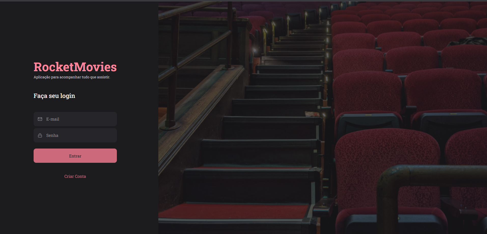
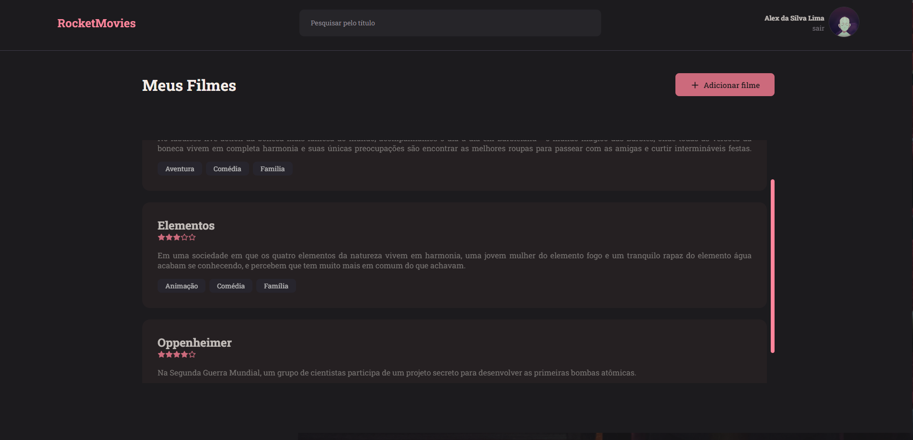
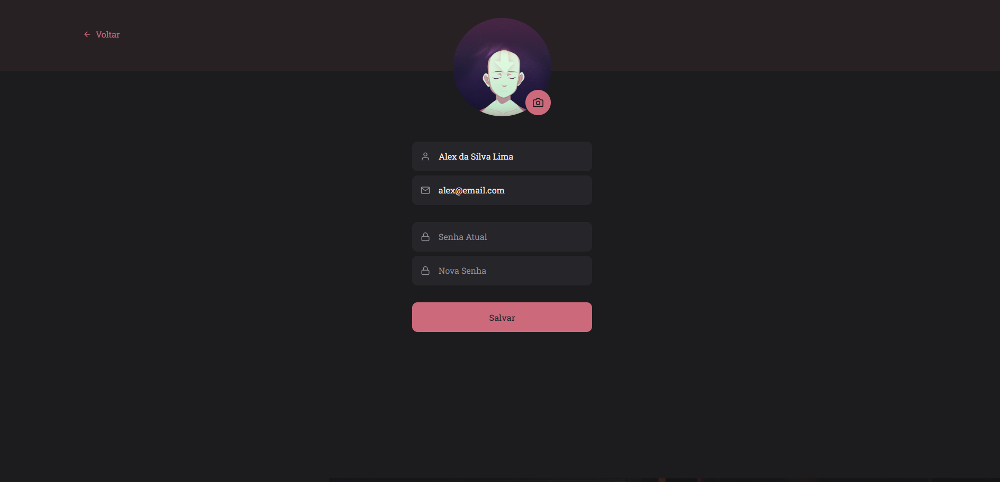
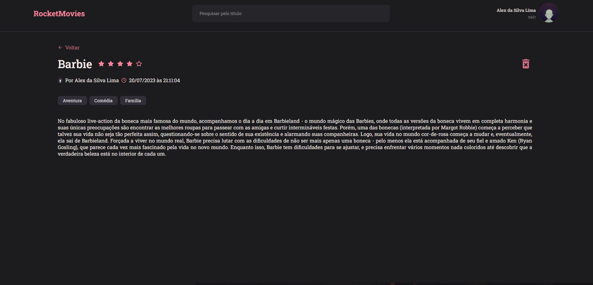
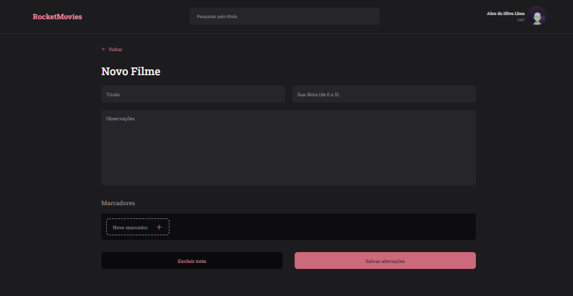

<h1 align="center"> Stage 09 - Desenvolvimento Front-End Aplicação Lista de Filmes</h1>
 

Você pode acessar o projeto Back-End através do link: 
  <a href= "https://github.com/A1exLima/rocketseat-stage8-backend-desafio" target="_blank"> Clique aqui ⏯ </a>

 

  <a href="#-tecnologias">👨‍💻 Tecnologias</a>&nbsp;&nbsp;&nbsp;|&nbsp;&nbsp;&nbsp;
  <a href="#-projeto">📄 Projeto</a>&nbsp;&nbsp;&nbsp;|&nbsp;&nbsp;&nbsp;
  <a href="#-layout">📱 Layout</a>&nbsp;&nbsp;&nbsp;|&nbsp;&nbsp;&nbsp;
  <a href="#-licença">🪪 Licença</a>
  <a href="#-licença">☁️ Deploy</a>
  </a>&nbsp;&nbsp;&nbsp;|&nbsp;&nbsp;&nbsp;

 

## 👨‍💻 Tecnologias

Esse projeto foi desenvolvido com as seguintes tecnologias:

- HTML
- CSS
- Java Script
- React JS (react, react-dom, react-icons, react-router-dom)
- Styled-components
- Vite (devDependencies)
- Axios
- Git e Github
- Figma

 

## 📄 Projeto

Desenvolvimento projeto front-end Rocket Movies, aplicação que cria nota de filmes, usando a biblioteca ReactJS.

  

 

  

 

  

 

  

 

  

O que foi abordado nesse desafio:

- Estrutura de pastas do projeto
- Funcionamento do React
- JSX
- Fragment
- Css in JS
- Temas
- Estilo Global
- Componentes
- Propriedades
- Rotas React-router

 

## 📱 Layout

Você pode visualizar o layout do projeto através [DESSE LINK](<https://www.figma.com/file/RHoYG5npcSsh9yk5L4MkGP/RocketMovies-(Copy)?node-id=0%3A1&mode=dev>). É necessário ter conta no [Figma](https://figma.com) para acessá-lo.

 

## 🪪 Licença

Esse projeto está sob a licença MIT.

 

## ☁️ Deploy

Você pode acessar o Website do projeto através do link: 
<a href= "https://rocketmovienotes.netlify.app/" target="_blank"> Clique aqui ⏯ </a>

 

---

Feito com  ♥  by Alex Lima
